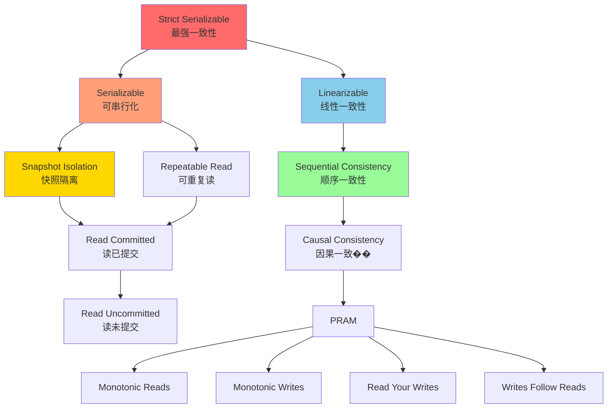
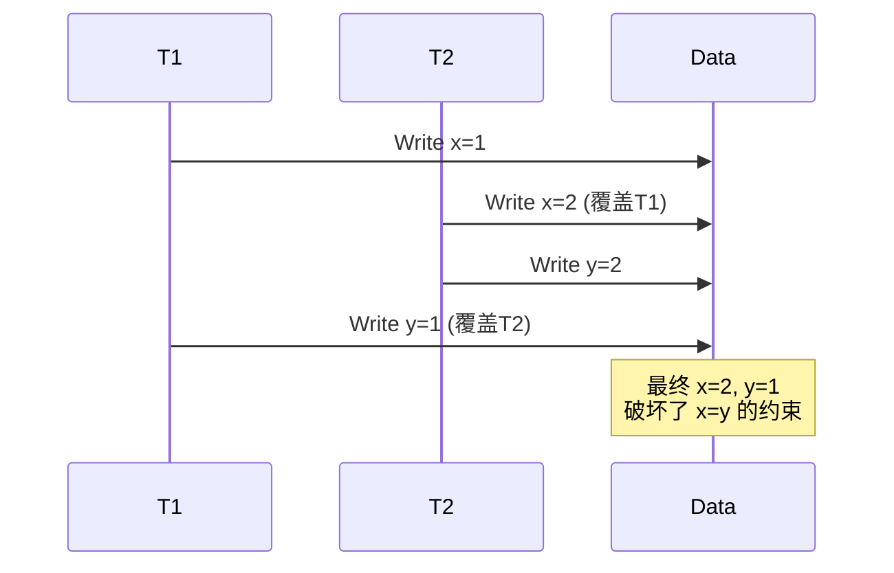
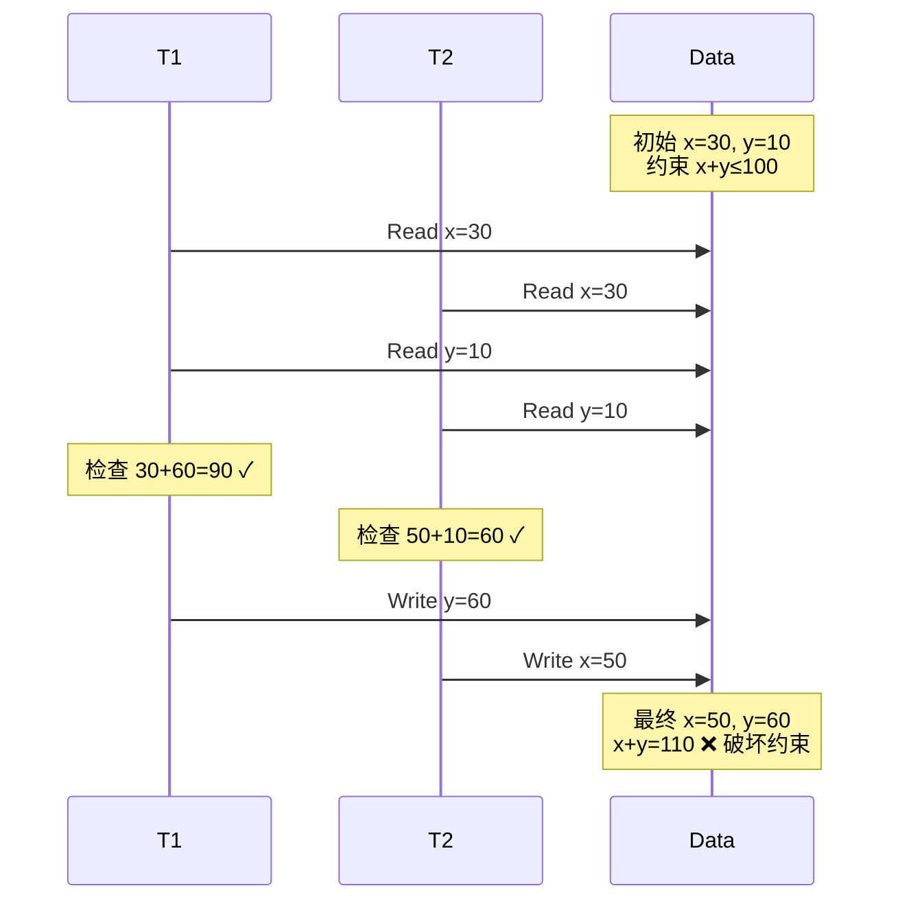
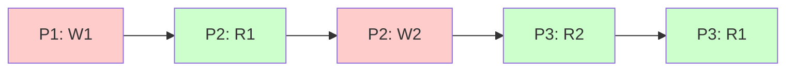
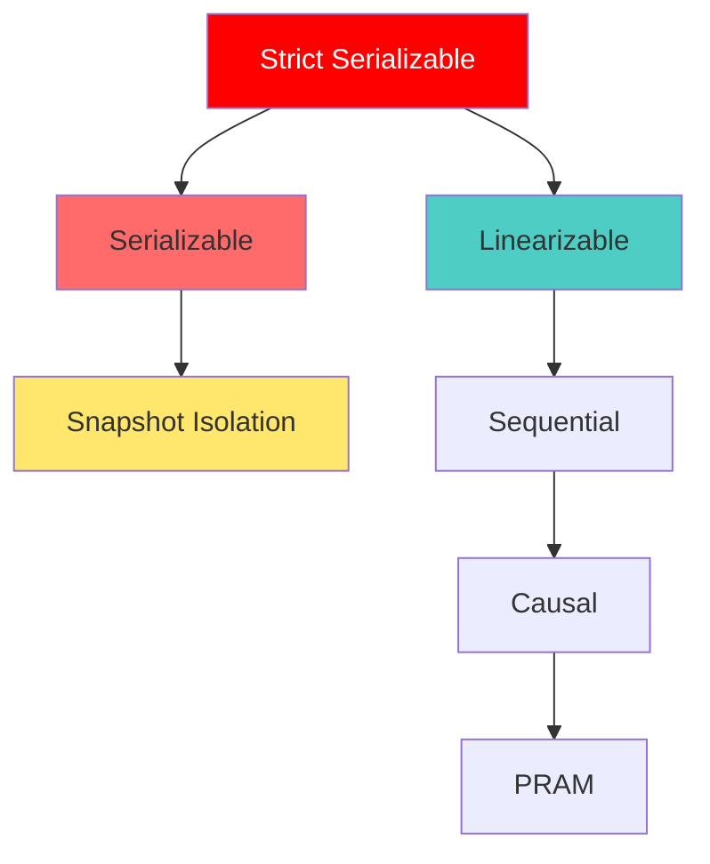
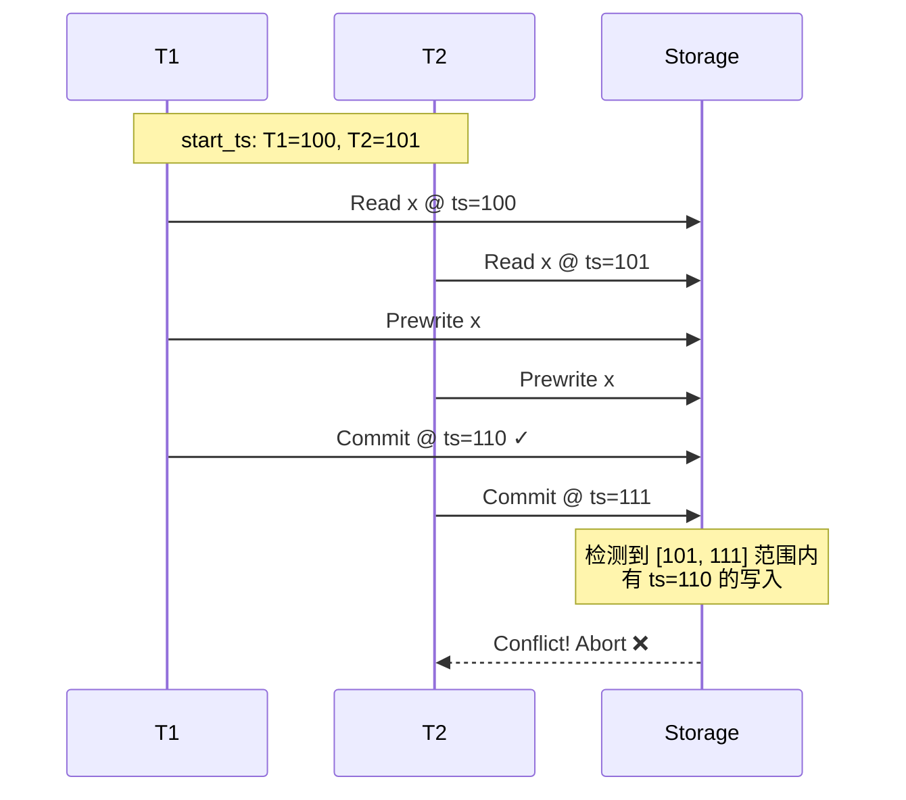

# 数据库隔离级别与一致性模型深度解析

> 本文档基于 Microsoft Research 论文《A Critique of ANSI SQL Isolation Levels》和简书文章《一致性模型》整理而成

## 目录

1. [隔离级别概述](#隔离级别概述)
2. [异常现象详解](#异常现象详解)
3. [隔离级别分类](#隔离级别分类)
4. [会话保证](#会话保证)
5. [一致性模型层次](#一致性模型层次)
6. [TiKV 实现分析](#tikv-实现分析)
7. [技术深度分析](#技术深度分析)

---

## 隔离级别概述

### 核心概念

隔离级别（Isolation Level）是 ACID 事务特性中的 "I"，定义了事务之间的可见性规则。在分布式系统中，我们需要同时考虑：

- **Isolation（隔离级别）**：ACID 中的 I，关注数据库事务隔离
- **Consistency（一致性）**：CAP 中的 C，关注分布式节点间的数据一致性

### 可用性分类

根据 HATs（Highly Available Transactions）论文，系统可分为：

1. **Unavailable（不可用）**：网络分区时为保证一致性而停止服务（CP 系统）
2. **Sticky Available（粘性可用）**：部分节点故障时，客户端在未故障节点上保持可用，但需保证操作一致性
3. **Highly Available（高可用）**：即使网络分区，未故障节点仍可用（AP 系统）



---

## 异常现象详解

### P0 - Dirty Write（脏写）

一个事务覆盖了另一个未提交事务写入的值。

**场景**：两个事务分别写入 x=y=1 和 x=y=2

```
时间线：
T1: Wx(1) -------- Wy(1)
T2: ------ Wx(2) Wy(2) ----
结果: x=2, y=1  ❌ 破坏一致性
```



### P1 - Dirty Read（脏读）

读取到未提交事务的修改数据。

**场景**：转账 x→y 40元，约束 x+y=100

```
时间线：
T1: Wx(10) -------- Wy(90)
T2: ------ Rx(10) Ry(50) ----
T2读到: x+y=60  ❌ 破坏约束
```

### P2 - Fuzzy Read / Non-Repeatable Read（不可重复读）

事务执行期间读到其他事务的更新。

```
时间线：
T1: Rx(50) -------- Ry(90)
T2: ------ Wx(10) Wy(90) ----
T1读到: 先x=50, 后y=90, 总和140  ❌
```

### P3 - Phantom（幻读）

按条件查询时，其他事务插入了满足条件的新数据。

```
场景：统计员工数量
T1: SELECT COUNT(*) WHERE condition → 3
T2: INSERT new_employee
T1: SELECT COUNT(*) → 4  ❌ 出现幻影记录
```

### P4 - Lost Update（更新丢失）

```
T1: ----------- Wx(110)
T2: --- Wx(120) --------
结果: x=110, T2的更新丢失
```

### A5A - Read Skew（读偏斜）

读取到不一致的数据快照。

```
约束: x+y=100
T1: Rx(50) -------- Ry(75)
T2: ------ Wx(25) Wy(75) ----
T1看到: x+y=125  ❌
```

### A5B - Write Skew（写偏斜）

并发事务破坏完整性约束。

```
约束: x+y≤100
T1: Rx(30) Ry(10) Wy(60) ----
T2: Rx(30) Ry(10) ---- Wx(50)
结果: x+y=110  ❌ 破坏约束
```



---

## 隔离级别分类

### 隔离级别对比表

| 隔离级别 | P0 | P1 | P4C | P4 | P2 | P3 | A5A | A5B |
|---------|----|----|-----|----|----|----|----|-----|
| Read Uncommitted | NP | P | P | P | P | P | P | P |
| Read Committed | NP | NP | P | P | P | P | P | P |
| Cursor Stability | NP | NP | NP | SP | SP | P | P | SP |
| Repeatable Read | NP | NP | NP | NP | NP | P | NP | NP |
| Snapshot | NP | NP | NP | NP | NP | SP | NP | P |
| Serializable | NP | NP | NP | NP | NP | NP | NP | NP |

- **NP** (Not Possible): 不可能发生
- **SP** (Sometimes Possible): 有时可能发生
- **P** (Possible): 会发生

### 各级别详解

#### 1. Read Uncommitted（读未提交）
- 能读到其他事务未提交的修改
- 最低隔离级别，几乎无隔离保证
- 性能最高，但数据一致性最差

#### 2. Read Committed（读已提交）
- 只能读到已提交的修改
- 避免脏读，但仍可能不可重复读
- 大多数数据库的默认级别

#### 3. Cursor Stability（游标稳定）
- 使用游标引用数据时，数据不可被其他事务更改
- 游标释放或事务提交后才允许修改
- 介于 RC 和 RR 之间

#### 4. Repeatable Read（可重复读）
- 同一事务中多次读取同一数据得到相同结果
- 避免不可重复读，但可能出现幻读
- MySQL InnoDB 的默认级别

#### 5. Snapshot Isolation（快照隔离）
- 每个事务在独立一致的快照上操作
- 提交时检测冲突（First-Committer-Wins）
- 避免大部分异常，但可能出现写偏斜
- PostgreSQL、TiDB 使用此���别

#### 6. Serializable（可串行化）
- 最高隔离级别
- 事务按某种顺序串行执行
- 避免所有异常现象

---

## 会话保证

Session Guarantees 用于保证会话内的实时性约束和操作顺序。

### 1. Writes Follow Reads（写跟随读）

如果进程读到写入 w1 的值，然后执行写入 w2，则 w2 在 w1 之后可见。

```
P1: R(w1) → W(w2)
其他进程: 必须先看到 w1，才能看到 w2
```

### 2. Monotonic Reads（单调读）

进程的读操作不会看到比之前读操作更旧的数据。

```
P1: R1(v1) → R2(v2)
保证: v2 的时间戳 ≥ v1 的时间戳
```

### 3. Monotonic Writes（单调写）

进程的写操作按顺序对所有进程可见。

```
P1: W1 → W2
所有进程: 观察到 W1 在 W2 之前
```

### 4. Read Your Writes（读己之写）

进程能读到自己之前的写入。

```
P1: W(x) → R(x)
保证: R 能看到 W 的结果
```

### 5. PRAM（Pipeline RAM）

单个进程的写操作被观察为顺序的，但不同进程可能观察到不同顺序。

```
P1: W(1)
P2: R(1) → W(2)
P3: R(2) → R(1)  ✓ 允许
P4: R(1) → R(2)  ✓ 允许
```

### 6. Causal Consistency（因果一致性）

有因果关系的操作在所有进程间保持一致顺序。

```
P1: W(1)
P2: R(1) → W(2)  // W(2) 因果依赖 W(1)
P3: R(2) → R(1)  ✓ 必须先看到 W(1)
P4: R(1) → R(2)  ✓ 允许
```



### 7. Sequential Consistency（顺序一致性）

所有操作按某种顺序发生，且该顺序在所有进程上一致。进程可能读到旧数据，但一旦读到新状态就不能再读到旧状态。

```
P1: W(1)
P2: W(2)
P3: R(1) → R(2)  ✓ 可以滞后
P4: R(2) → R(2)  ✓ 保持在新状态
P3: R(2) → R(1)  ❌ 不能回退
```

### 8. Linearizability（线性一致性）

所有操作按实时顺序原子发生。如果操作 A 在 B 开始前结束，则 B 必须在 A 之后生效。

```
P1: W(1) [完成]
P2: -------- W(2) [开始]
P3: ------------ R(?)
P3 只能读到 1，不能读到 0
```

---

## 一致性模型层次

### Strict Serializable（严格可串行化）

结合 Serializable + Linearizable，是最强的一致性模型：
- 事务按实时顺序串行执行
- 所有进程观察到完全一致的顺序



---

## TiKV 实现分析

### 时间戳分配

TiKV 通过 PD（Placement Driver）分配单调递增的时间戳：
- **start_ts**：事务开始时分配
- **commit_ts**：事务提交时分配

由于 PD 是单点授时服务，时间戳保证单调递增，满足 **Linearizable**。

### 隔离级别

TiKV 采用 **Snapshot Isolation + Linearizable**：

1. **MVCC 模型**：每个 key-value 带时间戳，生成数据库快照
2. **Snapshot Isolation**：事务在独立快照上操作
3. **Write Skew 问题**：需要显式加锁实现 Serializable Snapshot Isolation
4. **Phantom 限制**：不支持范围锁，某些场景下 Phantom 仍可能发生（Sometimes Possible）

### Read Committed 的特殊性

TiKV 的 Read Committed 与传统数据库不同：
- 可能读到事务在某个节点的提交，但在其他节点尚未提交
- 分布式系统中不同节点的事务提交有网络延迟
- **不建议生产环境使用**

---

## 技术深度分析

### 1. 隔离级别的实现机制

#### 锁机制（Lock-Based）

**两阶段锁（2PL）**：
- Growing Phase：获取锁
- Shrinking Phase：释放锁
- 实现 Serializable，但性能较差

**多粒度锁（MGL）**：
- 表锁、页锁、行锁
- 意向锁（IS、IX、SIX）
- 平衡并发性和开销

#### MVCC（Multi-Version Concurrency Control）

**核心思想**：
- 写操作创建新版本，不覆盖旧版本
- 读操作根据时间戳选择版本
- 读写不冲突，提高并发性

**版本管理**：
```
Key: user_123
Versions:
  ts=100: {name: "Alice", age: 25}
  ts=95:  {name: "Alice", age: 24}
  ts=90:  {name: "Alice", age: 23}
```

**读取规则**：
- 事务 start_ts=97 → 读到 ts=95 的版本
- 事务 start_ts=102 → 读到 ts=100 的版本

### 2. Snapshot Isolation 的冲突检测

**First-Committer-Wins 规则**：



### 3. 写偏斜的根本原因

写偏斜发生的条件：
1. 两个事务读取重叠的数据集
2. 基于读取结果做出决策
3. 修改不同的数据项
4. 约束跨越多个数据项

**解决方案**：
- **Serializable Snapshot Isolation (SSI)**：检测读写依赖
- **显式锁**：`SELECT FOR UPDATE`
- **物化冲突**：将隐式约束转为显式记录

### 4. 分布式事务的挑战

#### 时钟偏移

**问题**：
- 不同节点的物理时钟可能不同步
- 时间戳可能不反映真实的因果关系

**解决方案**：
- **TrueTime（Google Spanner）**：使用 GPS 和原子钟，提供时间区间
- **Hybrid Logical Clock（HLC）**：结合物理时钟和逻辑时钟
- **中心化 TSO**：单点授时服务（TiKV 方案）

#### 网络分区

**CAP 权衡**：
- **CP 系统**：牺牲可用性保证一致性（Spanner、TiKV）
- **AP 系统**：牺牲一致性保证可用性（Cassandra、DynamoDB）

### 5. 性能优化技术

#### 乐观并发控制（OCC）

适用于冲突率低的场景：
1. Read Phase：读取数据到本地
2. Validation Phase：检测冲突
3. Write Phase：提交修改

#### 悲观并发控制（PCC）

适用于冲突率高的场景：
- 读取时加锁
- 避免回滚，但降低并发性

#### 混合模式

TiKV 支持乐观和悲观事务：
- 默认悲观事务（减少重试）
- 低冲突场景可选乐观事务

---

## 实践应用与最佳实践

### 1. 选择合适的隔离级别

| 场景 | 推荐级别 | 原因 |
|------|---------|------|
| 金融交易 | Serializable | 严格一致性要求 |
| 电商库存 | Repeatable Read + 锁 | 防止超卖 |
| 社交媒体 | Read Committed | 高并发，容忍短暂不一致 |
| 分析查询 | Snapshot | 一致性快照，不阻塞写入 |
| 缓存系统 | Read Uncommitted | 性能优先 |

### 2. 避免写偏斜

**场景**：会议室预订系统，约束"同一时间段最多一个预订"

**错误做法**：
```sql
-- T1 和 T2 并发执行
SELECT COUNT(*) FROM bookings
WHERE room_id = 101 AND time_slot = '10:00-11:00';
-- 返回 0

INSERT INTO bookings (room_id, time_slot, user_id)
VALUES (101, '10:00-11:00', 'user1');
-- T1 和 T2 都插入成功 ❌
```

**正确做法**：
```sql
-- 方案 1：显式锁
SELECT * FROM bookings
WHERE room_id = 101 AND time_slot = '10:00-11:00'
FOR UPDATE;

-- 方案 2：物化冲突
CREATE TABLE room_slots (
  room_id INT,
  time_slot VARCHAR(20),
  booked_by INT,
  PRIMARY KEY (room_id, time_slot)
);

INSERT INTO room_slots (room_id, time_slot, booked_by)
VALUES (101, '10:00-11:00', 'user1')
ON CONFLICT DO NOTHING;
```

### 3. 处理幻读

**场景**：统计满足条件的记录数

**问题**：
```sql
-- T1
SELECT COUNT(*) FROM employees WHERE dept = 'Sales';  -- 返回 10

-- T2 插入新员工
INSERT INTO employees (name, dept) VALUES ('Bob', 'Sales');

-- T1 再次查询
SELECT COUNT(*) FROM employees WHERE dept = 'Sales';  -- 返回 11 ❌
```

**解决方案**：
```sql
-- 方案 1：Serializable 隔离级别
SET TRANSACTION ISOLATION LEVEL SERIALIZABLE;

-- 方案 2：范围锁（如果数据库支持）
SELECT * FROM employees WHERE dept = 'Sales' FOR UPDATE;

-- 方案 3：物化范围
CREATE TABLE dept_counts (
  dept VARCHAR(50) PRIMARY KEY,
  count INT
);
-- 锁定部门记录而非扫描所有员工
```

### 4. 监控与调优

**关键指标**：
- 事务冲突率
- 事务回滚率
- 锁等待时间
- MVCC 版本数量

**调优建议**：
1. **减小事务粒度**：避免长事务
2. **优化访问顺序**：按固定顺序访问资源，避免死锁
3. **使用合适的索引**：减少锁范围
4. **批量操作**：减少事务数量
5. **读写分离**：降低主库压力

### 5. 分布式场景的特殊考虑

**跨区域部署**：
- 使用 Follower Read 降低延迟
- 容忍 Stale Read（读取稍旧的数据）
- 关键业务使用 Strong Consistency Read

**热点数据**：
- 应用层分片
- 使用缓存
- 悲观锁 + 重试机制

---

## 总结

### 核心要点

1. **隔离级别是权衡**：一致性 vs 性能
2. **理解异常现象**：知道每个级别可能出现的问题
3. **分布式复杂性**：Isolation + Consistency 交织
4. **实践选择**：根据业务需求选择合适级别

### 一致性模型对比

| 模型 | 保证 | 性能 | 适用场景 |
|------|------|------|---------|
| Strict Serializable | 最强 | 最低 | 金融核心系统 |
| Serializable | 串行化 | 低 | 强一致性需求 |
| Snapshot Isolation | 快照一致 | 中 | 大多数 OLTP |
| Linearizable | 实时顺序 | 中低 | 分布式协调 |
| Causal | 因果顺序 | 中高 | 社交网络 |
| Eventual | 最终一致 | 最高 | 缓存、日志 |

### TiKV 的定位

TiKV = **Snapshot Isolation + Linearizable**
- 通过 PD 单点授时保证 Linearizable
- 通过 MVCC 实现 Snapshot Isolation
- 支持 Serializable Snapshot Isolation（需显式锁）
- 不完全防止 Phantom（范围锁限制）

这种设计在一致性和性能之间取得了良好平衡，适合大多数 OLTP 场景。