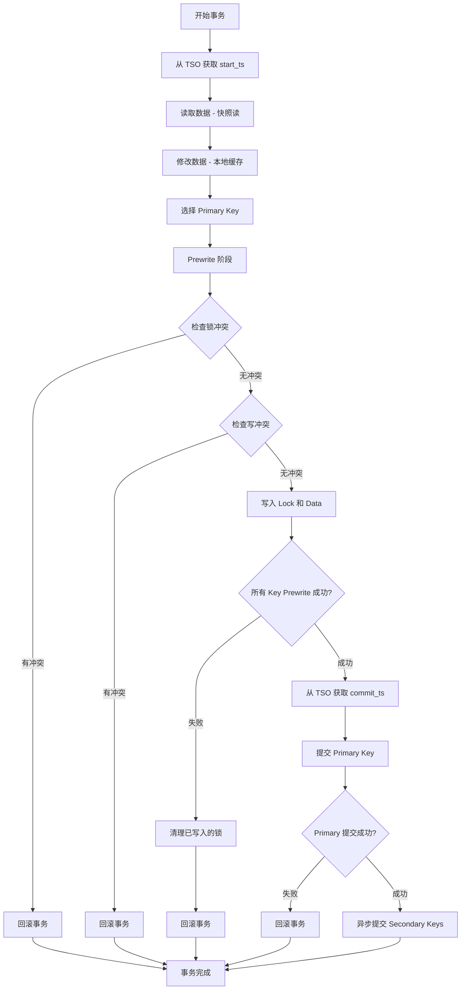
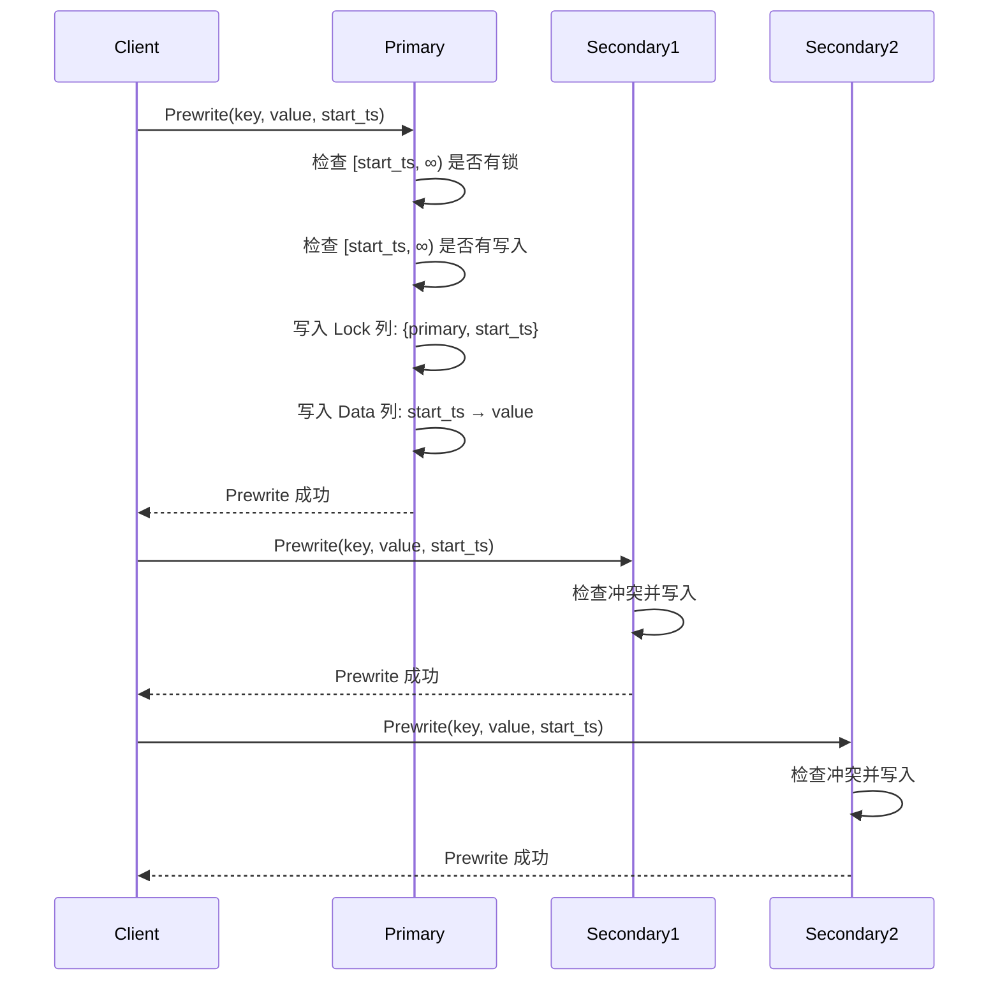
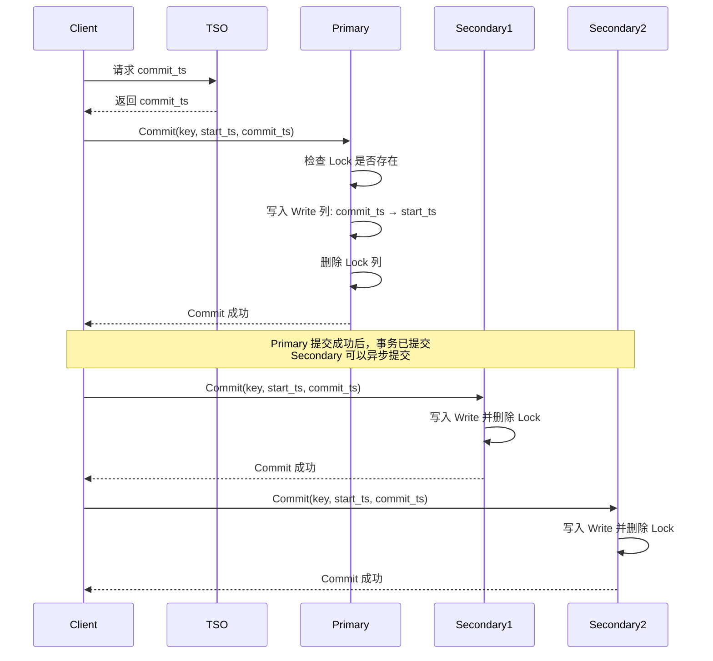
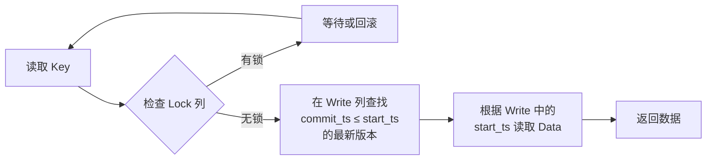
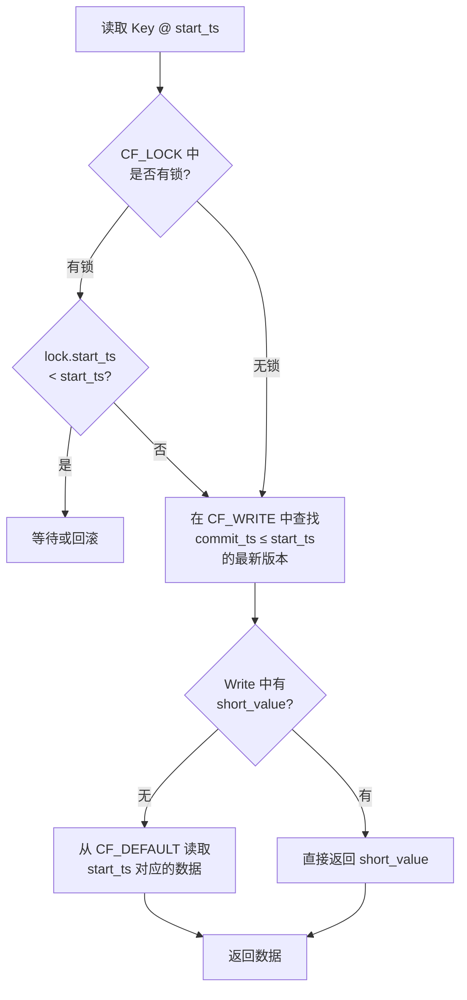
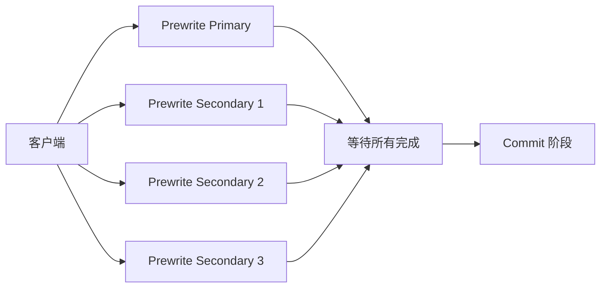
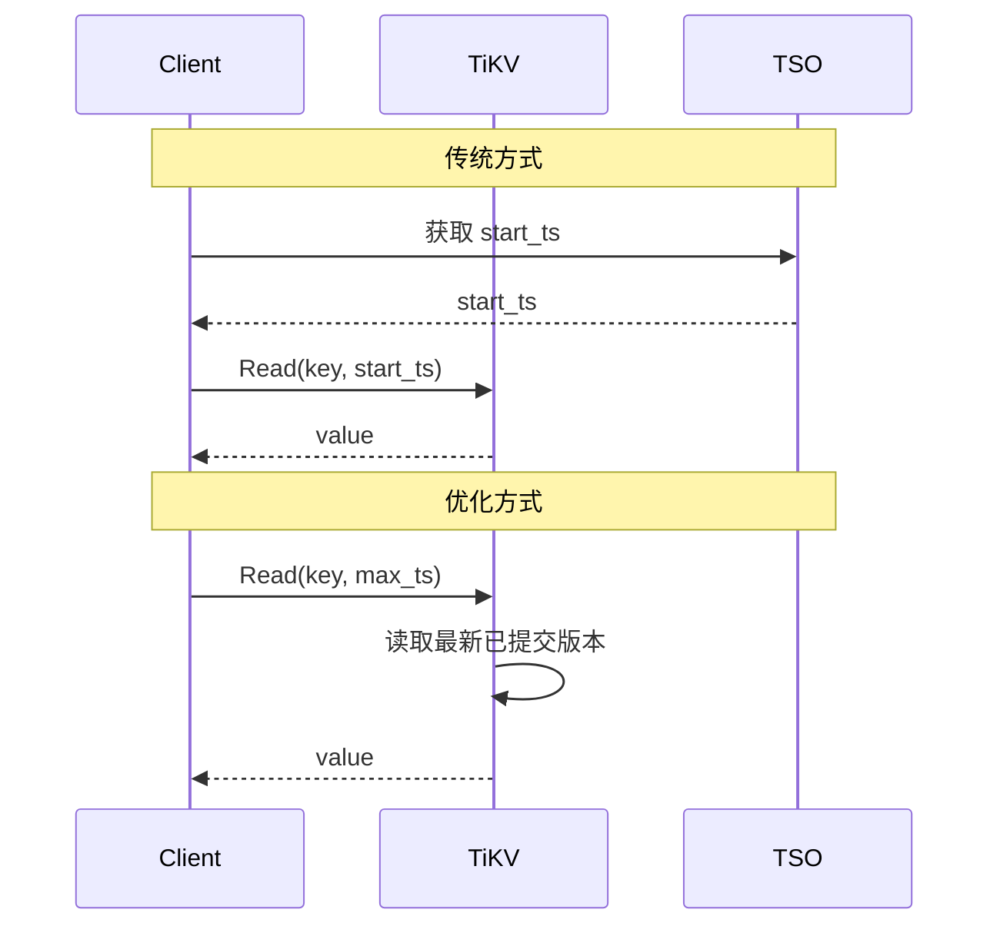
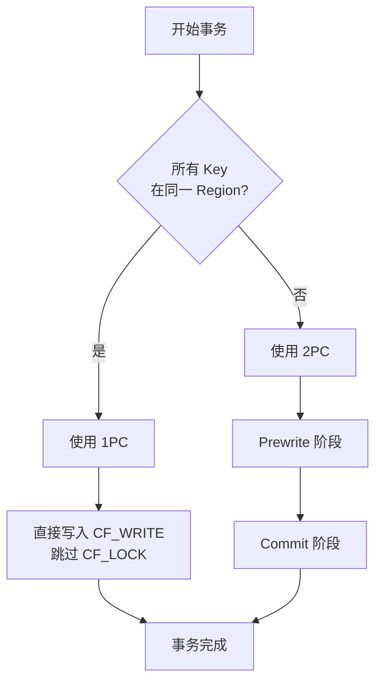
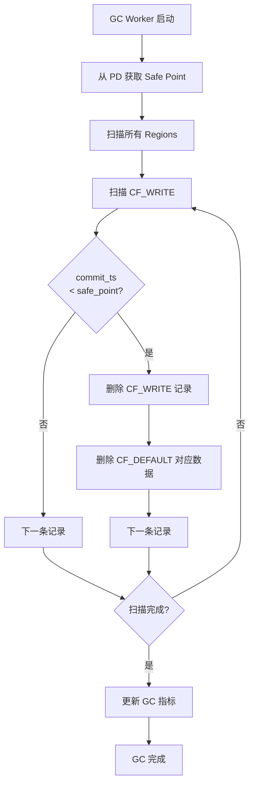

# Percolator 分布式事务深度解析

## 目录

1. [Percolator 算法概述](#percolator-算法概述)
2. [基础 Percolator 实现](#基础-percolator-实现)
3. [TiKV 中的 Percolator 实现](#tikv-中的-percolator-实现)
4. [TiKV 的 Percolator 优化](#tikv-的-percolator-优化)
5. [技术深度分析](#技术深度分析)
6. [实践应用与最佳实践](#实践应用与最佳实践)

---

## Percolator 算法概述

### 什么是 Percolator？

Percolator 是 Google 在 2010 年发表的一种基于 Bigtable 构建的分布式事务协议，最初用于处理大规模增量索引更新。它通过在分布式存储系统之上实现 ACID 事务语义，为分布式数据库提供了一种优雅的事务解决方案。

### 核心设计理念

Percolator 的设计基于以下几个关键理念：

1. **乐观并发控制（OCC）**：假设冲突较少，事务提交时才检测冲突
2. **两阶段提交（2PC）**：通过 Prewrite 和 Commit 两个阶段保证原子性
3. **MVCC（多版本并发控制）**：每个写操作都带有时间戳，支持快照隔离
4. **去中心化协调**：不依赖中心化的事务管理器，通过分布式锁实现协调

### Percolator 事务流程图



---

## 基础 Percolator 实现

### 数据模型

Percolator 在 Bigtable 之上构建了三个逻辑列族：

1. **Lock 列**：存储事务锁信息
   - 格式：`{primary_key, lock_type, start_ts}`
   - 用途：防止并发事务修改同一行

2. **Write 列**：存储已提交的版本信息
   - 格式：`commit_ts → start_ts`
   - 用途：记录数据的提交时间戳和对应的数据版本

3. **Data 列**：存储实际数据
   - 格式：`start_ts → value`
   - 用途：保存多个版本的数据值

### 时间戳分配

Percolator 依赖一个全局的 **Timestamp Oracle (TSO)** 来分配单调递增的时间戳：

- **start_ts**：事务开始时分配，用于读取快照和标识数据版本
- **commit_ts**：事务提交时分配，用于标记数据的可见性

### 两阶段提交详解

#### Prewrite 阶段

Prewrite 是事务提交的第一阶段，目标是为所有修改的 Key 加锁并写入数据：



**Prewrite 步骤**：

1. **选择 Primary Key**：从所有修改的 Key 中选择一个作为 Primary，其余为 Secondary
2. **冲突检测**：
   - 检查 Lock 列是否存在锁（任意时间戳）
   - 检查 Write 列是否有 `[start_ts, ∞)` 范围内的写入
3. **写入数据**：
   - Lock 列：写入 `{primary_key, start_ts}`
   - Data 列：写入 `start_ts → value`

如果任何一个 Key 的 Prewrite 失败，整个事务回滚。

#### Commit 阶段

Commit 是事务提交的第二阶段，目标是使数据对其他事务可见：



**Commit 步骤**：

1. **获取 commit_ts**：从 TSO 获取全局唯一的提交时间戳
2. **提交 Primary Key**：
   - 检查 Lock 是否存在且 start_ts 匹配
   - 写入 Write 列：`commit_ts → start_ts`
   - 删除 Lock 列
3. **提交 Secondary Keys**：
   - Primary 提交成功后，事务已经提交
   - Secondary Keys 可以异步提交，即使失败也不影响事务结果

**关键点**：Primary Key 的提交是事务的提交点（Commit Point）。一旦 Primary 提交成功，事务就不可回滚。

### 读操作

Percolator 支持快照隔离级别的读取：



**读取步骤**：

1. **检查锁**：如果 Lock 列存在锁，说明有未提交的事务正在修改该 Key
   - 如果锁的 start_ts < 当前事务的 start_ts，等待或回滚
   - 否则，当前事务的快照不应该看到这个锁

2. **查找版本**：在 Write 列中查找 `commit_ts ≤ start_ts` 的最新版本
   - Write 列的格式：`commit_ts → data_start_ts`

3. **读取数据**：根据 Write 列中记录的 `data_start_ts`，从 Data 列读取对应版本的数据

### 写操作

写操作在事务提交时才真正执行（Prewrite + Commit）：

1. **本地缓存**：事务执行期间，所有修改都保存在客户端的本地缓存中
2. **Prewrite**：事务提交时，将所有修改写入存储层（带锁）
3. **Commit**：使修改对其他事务可见

### 冲突处理

Percolator 使用乐观并发控制，冲突在 Prewrite 阶段检测：

**写-写冲突**：
- 场景：两个事务修改同一个 Key
- 检测：Prewrite 时检查 Lock 列和 Write 列
- 处理：后提交的事务回滚

**读-写冲突**：
- 场景：事务 T1 读取 Key，事务 T2 修改 Key 并提交
- 检测：T1 在 Prewrite 时检查 Write 列是否有 `[start_ts, ∞)` 范围内的写入
- 处理：T1 回滚（快照隔离保证）

### 崩溃恢复

Percolator 通过 Primary Key 机制实现崩溃恢复：

**场景 1：Prewrite 阶段崩溃**
- 现象：部分 Key 有 Lock，但 Primary 未提交
- 恢复：任何事务遇到过期的 Lock 时，检查 Primary 的状态
  - 如果 Primary 没有 Lock，说明事务已回滚，清理 Secondary 的 Lock
  - 如果 Primary 有 Lock，说明事务未完成，可以安全回滚

**场景 2：Commit 阶段崩溃**
- 现象：Primary 已提交，部分 Secondary 未提交
- 恢复：任何事务遇到 Lock 时，检查 Primary 的状态
  - 如果 Primary 已提交（Write 列有记录），继续提交 Secondary
  - 如果 Primary 未提交，回滚事务

**关键机制**：
- **Primary Key 作为事务状态的唯一来源**
- **Lock 中记录 Primary Key 的位置**
- **任何事务都可以帮助清理过期的锁**

---

## TiKV 中的 Percolator 实现

### RocksDB Column Families

TiKV 使用 RocksDB 作为底层存储引擎，将 Percolator 的三个逻辑列映射到四个 Column Families：

1. **CF_DEFAULT**：存储实际数据（对应 Data 列）
   - Key: `{user_key}{start_ts}`
   - Value: `{user_value}`

2. **CF_LOCK**：存储事务锁（对应 Lock 列）
   - Key: `{user_key}`
   - Value: `{lock_type, primary_key, start_ts, ttl, short_value}`

3. **CF_WRITE**：存储已提交的版本信息（对应 Write 列）
   - Key: `{user_key}{commit_ts}`
   - Value: `{write_type, start_ts, short_value}`

4. **CF_RAFT**：存储 Raft 日志和元数据

### Key 编码格式

TiKV 使用特殊的 Key 编码来支持 MVCC：

```
User Key: "user_key"
CF_DEFAULT: "user_key\x00\x00\x00\x00\xFF\xFF\xFF\xFF" (start_ts 的补码)
CF_WRITE:   "user_key\x00\x00\x00\x00\xFF\xFF\xFF\xFF" (commit_ts 的补码)
CF_LOCK:    "user_key"
```

**时间戳编码**：使用补码（`^ts`）确保时间戳大的 Key 排在前面，方便范围查询。

### 无锁读取

TiKV 的读取操作不需要加锁，通过 MVCC 实现快照隔离：



### 历史版本读取

TiKV 支持读取历史版本的数据（Time Travel）：

- 指定任意 `start_ts`，读取该时间点的快照
- 用于数据审计、回滚、备份等场景
- 依赖 GC（垃圾回收）策略保留历史版本

---

## TiKV 的 Percolator 优化

### 1. 并行 Prewrite

**原始 Percolator**：客户端串行执行所有 Key 的 Prewrite

**TiKV 优化**：并行执行 Prewrite，显著降低延迟



**优势**：
- 减少网络往返次数
- 充分利用分布式系统的并行性
- 对于大事务（修改多个 Key）效果显著

### 2. Short Value in Write Column

**问题**：小值（如计数器、标志位）需要两次读取（CF_WRITE + CF_DEFAULT）

**优化**：将小于 64 字节的值直接存储在 CF_WRITE 中

```
CF_WRITE:
  Key: {user_key}{commit_ts}
  Value: {write_type, start_ts, short_value}  // short_value 内联存储
```

**优势**：
- 减少一次磁盘 I/O
- 降低读取延迟
- 对于小值场景（如计数器、索引）效果显著

### 3. Point Read Without Timestamp

**问题**：读取最新版本仍需要从 TSO 获取 start_ts

**优化**：引入 `max_ts` 概念，直接读取最新版本



**优势**：
- 减少与 TSO 的交互
- 降低读取延迟
- 适用于不需要快照隔离的场景（如读取最新值）

### 4. Calculated Commit Timestamp

**问题**：Commit 阶段需要从 TSO 获取 commit_ts，增加延迟

**优化**：在某些情况下，可以根据 start_ts 计算 commit_ts

**条件**：
- 事务只修改一个 Key（单 Key 事务）
- 或者事务的所有 Key 都在同一个 Region

**计算方式**：
```
commit_ts = max(start_ts + 1, region_max_ts + 1)
```

**优势**：
- 减少与 TSO 的交互
- 降低事务提交延迟
- 对于单 Key 事务效果显著

### 5. Single Region 1PC

**问题**：即使事务的所有 Key 都在同一个 Region，仍需要两阶段提交

**优化**：如果事务的所有 Key 都在同一个 Region，使用一阶段提交（1PC）



**优势**：
- 跳过 Prewrite 阶段，直接写入 CF_WRITE
- 减少一半的写入操作
- 降低事务延迟
- 对于单 Region 事务效果显著

### 优化效果对比

| 优化 | 适用场景 | 延迟降低 | 吞吐提升 |
|------|---------|---------|---------|
| 并行 Prewrite | 大事务（多 Key） | 30-50% | 20-40% |
| Short Value | 小值读取 | 40-60% | 30-50% |
| Point Read | 读取最新值 | 20-30% | 15-25% |
| Calculated Commit TS | 单 Key 事务 | 15-25% | 10-20% |
| Single Region 1PC | 单 Region 事务 | 40-50% | 30-40% |

---

## 技术深度分析

### 1. 时间戳分配的挑战

**TSO 成为瓶颈**：
- 所有事务都需要从 TSO 获取时间戳
- TSO 是单点，容易成为性能瓶颈
- 网络延迟影响事务延迟

**TiKV 的解决方案**：
- **批量分配**：TSO 一次分配一批时间戳，减少 RPC 次数
- **本地缓存**：客户端缓存时间戳，减少与 TSO 的交互
- **TSO 高可用**：使用 PD（Placement Driver）集群实现 TSO 的高可用

**Hybrid Logical Clock (HLC)**：
- 结合物理时钟和逻辑时钟
- 减少对中心化 TSO 的依赖
- CockroachDB 使用 HLC 实现分布式时间戳

### 2. 锁的粒度与性能

**行级锁 vs 范围锁**：
- Percolator 使用行级锁，粒度细，并发度高
- 但对于范围查询，需要锁定多个行，开销大

**TiKV 的优化**：
- **Latch**：内存中的轻量级锁，用于同一 TiKV 节点内的并发控制
- **Lock 表**：持久化的锁，用于跨节点的并发控制
- **两级锁机制**：先获取 Latch，再写入 Lock 表

### 3. 垃圾回收（GC）

**MVCC 的代价**：
- 每次写入都会产生新版本
- 历史版本占用存储空间
- 需要定期清理过期版本

**TiKV 的 GC 策略**：
- **Safe Point**：所有活跃事务的最小 start_ts
- **GC Worker**：定期扫描并删除 `commit_ts < safe_point` 的版本
- **分布式 GC**：每个 Region 独立执行 GC，避免全局锁

**GC 流程**：



### 4. 事务冲突的优化

**冲突检测的开销**：
- Prewrite 时需要检查 Lock 和 Write 列
- 对于热点 Key，冲突检测成为瓶颈

**TiKV 的优化**：
- **Latch 机制**：在内存中快速检测冲突，避免磁盘 I/O
- **异步 Commit**：Primary 提交后立即返回，Secondary 异步提交
- **Pipelined Pessimistic Lock**：悲观锁的流水线优化

### 5. 悲观事务 vs 乐观事务

**乐观事务（Percolator 原始设计）**：
- 假设冲突较少，提交时才检测冲突
- 适用于冲突率低的场景
- 冲突时需要重试，用户体验差

**悲观事务（TiKV 扩展）**：
- 读取时加锁，避免冲突
- 适用于冲突率高的场景
- 增加锁的开销，但减少重试

**TiKV 的混合模式**：
- 支持乐观事务和悲观事务
- 用户可以根据场景选择
- 默认使用悲观事务

---

## 实践应用与最佳实践

### 1. 事务大小的权衡

**小事务**：
- 优势：冲突概率低，延迟低
- 劣势：吞吐量低，开销大

**大事务**：
- 优势：吞吐量高，批量操作效率高
- 劣势：冲突概率高，延迟高，回滚代价大

**最佳实践**：
- 单个事务修改的 Key 数量控制在 100-1000 之间
- 避免超大事务（> 10000 Keys）
- 使用批量操作 API 提高效率

### 2. 热点 Key 的处理

**问题**：
- 热点 Key 导致频繁冲突
- 单个 Region 成为瓶颈

**解决方案**：
- **应用层分片**：将热点 Key 拆分为多个 Key
- **缓存**：使用 Redis 等缓存热点数据
- **悲观锁**：对热点 Key 使用悲观锁，减少重试
- **Region 分裂**：TiKV 自动分裂热点 Region

### 3. 长事务的处理

**问题**：
- 长事务持有锁时间长，阻塞其他事务
- 长事务的 start_ts 较小，影响 GC

**最佳实践**：
- 避免长事务，将长事务拆分为多个短事务
- 使用异步处理或消息队列
- 设置合理的事务超时时间

### 4. 读写分离

**场景**：
- 读多写少的应用
- 需要降低读取延迟

**TiKV 的支持**：
- **Follower Read**：从 Raft Follower 读取数据，分担 Leader 压力
- **Stale Read**：读取稍旧的数据，避免等待 Raft 日志同步
- **Read-only Transaction**：只读事务不需要获取 commit_ts

### 5. 监控与调优

**关键指标**：
- **事务延迟**：P99、P999 延迟
- **冲突率**：Prewrite 失败率
- **GC 效率**：GC 删除的版本数、GC 延迟
- **TSO 延迟**：获取时间戳的延迟

**调优建议**：
- 监控热点 Key，及时优化
- 调整 GC Safe Point，平衡存储空间和历史查询需求
- 使用悲观事务降低冲突率
- 优化事务大小，避免超大事务

### 6. 故障恢复

**常见故障**：
- **TSO 不可用**：所有事务无法获取时间戳
- **Region 不可用**：部分数据无法访问
- **网络分区**：部分节点无法通信

**TiKV 的容错机制**：
- **PD 集群**：TSO 高可用，自动故障转移
- **Raft 复制**：数据多副本，自动故障恢复
- **Region 自动迁移**：故障节点的 Region 自动迁移到健康节点

---

## 总结

Percolator 是一种优雅的分布式事务协议，通过两阶段提交和 MVCC 实现了 ACID 事务语义。TiKV 在 Percolator 的基础上进行了大量优化，包括并行 Prewrite、Short Value、Point Read、Calculated Commit TS 和 Single Region 1PC 等，显著提升了性能。

**核心要点**：

1. **两阶段提交**：Prewrite 加锁，Commit 使数据可见
2. **Primary Key 机制**：作为事务状态的唯一来源，实现崩溃恢复
3. **MVCC**：支持快照隔离，无锁读取
4. **乐观并发控制**：假设冲突较少，提交时检测冲突
5. **TiKV 优化**：针对不同场景的性能优化，平衡延迟和吞吐

**适用场景**：

- 需�� ACID 事务保证的分布式系统
- 读多写少的应用（利用 MVCC 的无锁读取）
- 冲突率较低的场景（乐观并发控制）
- 需要历史版本查询的应用（Time Travel）

Percolator 的设计思想对分布式数据库领域产生了深远影响，TiDB、CockroachDB 等现代分布式数据库都借鉴了 Percolator 的设计。理解 Percolator 的原理和优化，对于构建高性能分布式系统具有重要意义。

