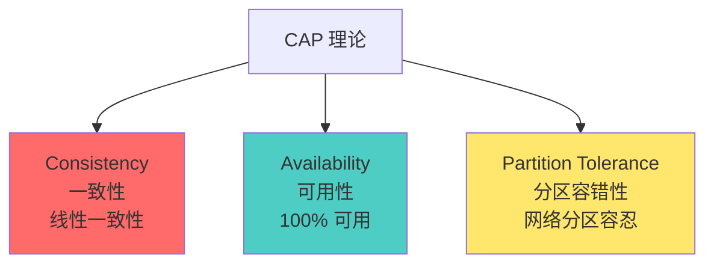
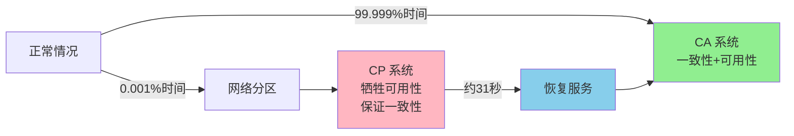
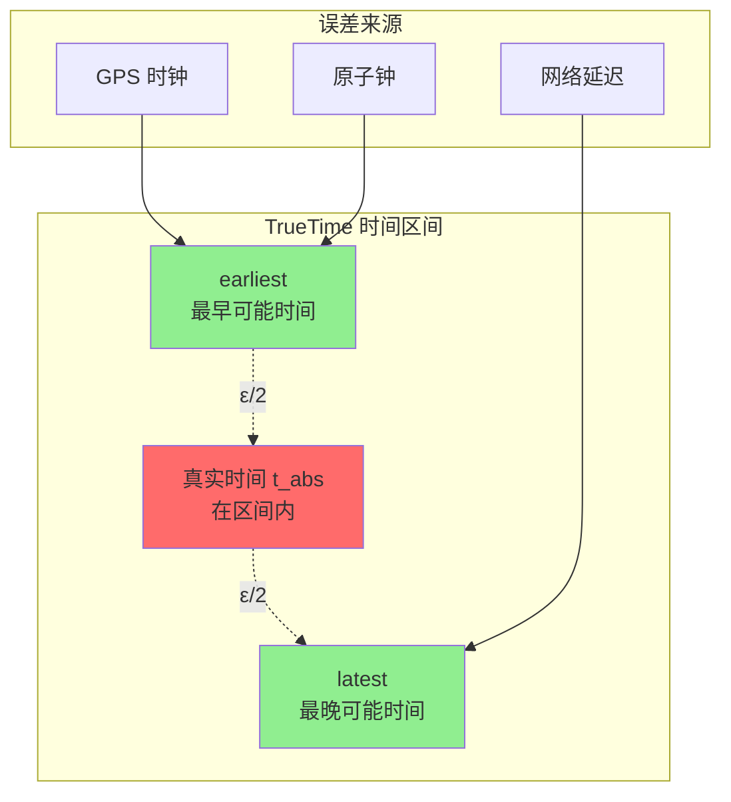
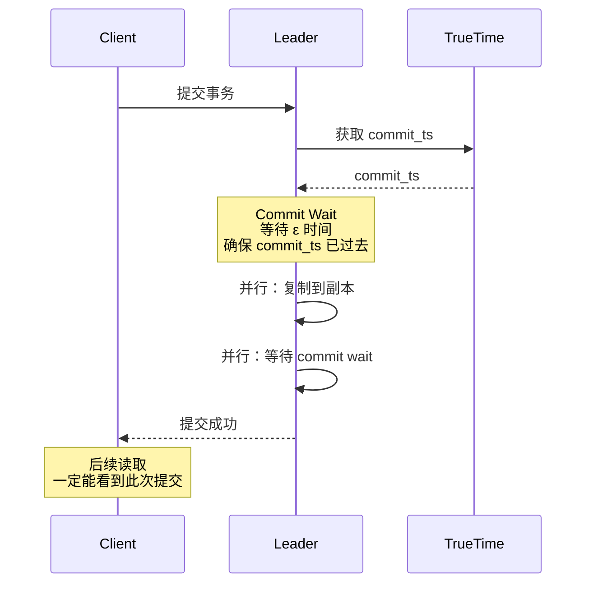
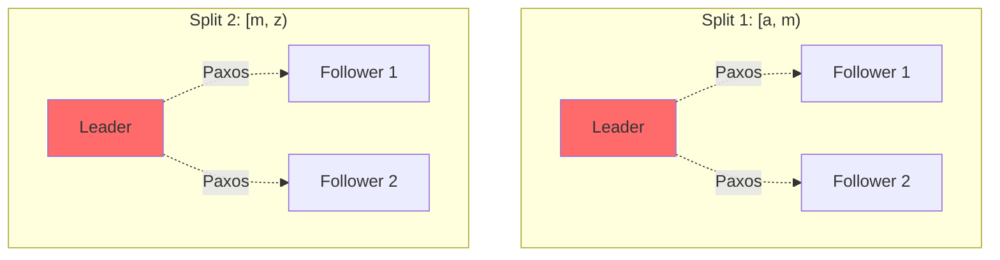
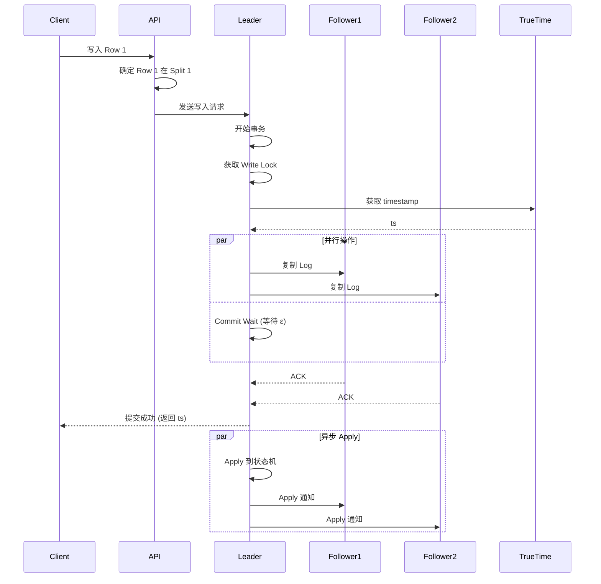
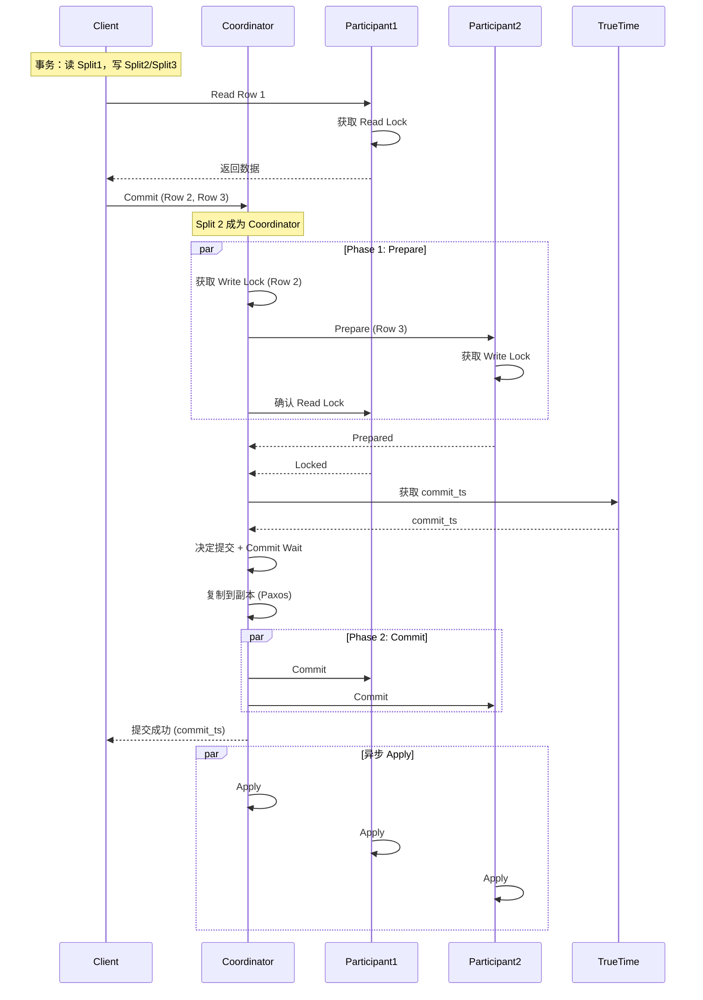
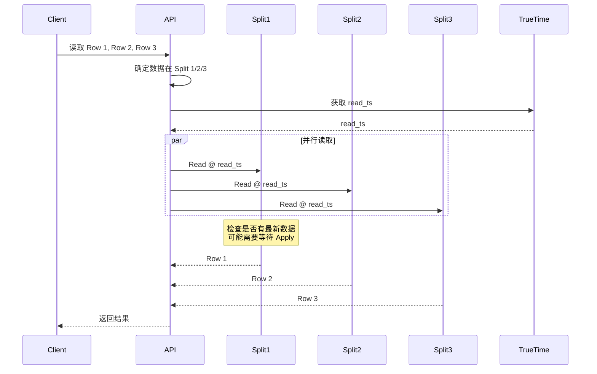
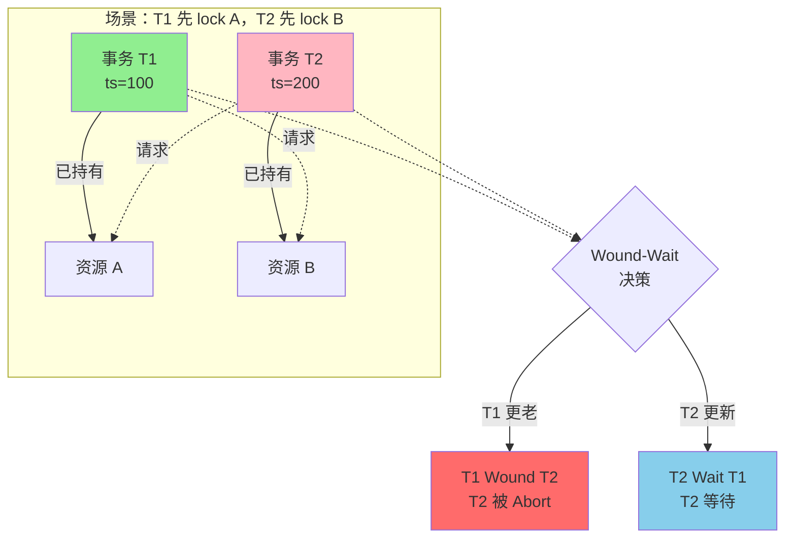

# Google Spanner 深度解析：CAP、TrueTime 与分布式事务

> 基于简书文章《Spanner: CAP, TrueTime and Transaction》整理

## 目录

1. [Spanner 概述](#spanner-概述)
2. [CAP 理论与 Spanner](#cap-理论与-spanner)
3. [TrueTime 技术](#truetime-技术)
4. [事务模型](#事务模型)
5. [技术深度分析](#技术深度分析)
6. [与 TiDB 对比](#与-tidb-对比)
7. [总结](#总结)

---

## Spanner 概述

### 什么是 Spanner？

Google Spanner 是全球首个真正意义上的全球分布式数据库，于 2012 年发表论文，2017 年作为 Spanner Cloud 正式对外发布。Spanner 的出现标志着 NewSQL 时代的到来，它成功地将传统关系型数据库的 ACID 特性与分布式系统的可扩展性结合在一起。

### 核心特性

1. **全球分布**：数据可以跨多个数据中心分布
2. **强一致性**：提供外部一致性（External Consistency）
3. **高可用性**：可用性优于 5 个 9（99.999%）
4. **SQL 支持**：完整的 SQL 语义和事务支持
5. **自动分片**：数据自动按 range 切分和迁移

---

## CAP 理论与 Spanner

### CAP 理论回顾



**CAP 三要素**：

- **C（Consistency）**：线性一致性，T 时刻写入的值在 T 之后一定能读到
- **A（Availability）**：100% 可用性，无论系统发生任何故障都能对外提供服务
- **P（Partition Tolerance）**：网络分区容忍性

### Spanner 的选择：CP + HA

Spanner 是一个 **CP + High Availability** 系统：

1. **牺牲完全可用性**：网络分区时优先保证一致性
2. **追求高可用性**：可用性优于 5 个 9，接近 6 个 9
3. **故障恢复快**：大故障情况下约 31 秒恢复服务
4. **多数时候是 CA**：Google 强大的自建网络使 P 很少发生



### 容灾策略

- **多副本**：关键数据可配置 7 个副本
- **跨区域部署**：数据中心分布在全球多个地理位置
- **自动故障转移**：Leader 故障时自动选举新 Leader
- **灾难恢复**：整个集群灾难性故障概率极低

---

## TrueTime 技术

### 为什么需要 TrueTime？

在分布式系统中，时间是确定事件顺序的关键。TrueTime 是 Spanner 最核心的创新之一。

**传统方案的问题**：

1. **全局序列号生成器**：
   - 单点瓶颈
   - 网络开销大
   - 故障转移复杂

2. **物理时钟**：
   - 不同节点时钟不同步
   - 时钟漂移问题
   - 无法保证因果关系

### TrueTime API

TrueTime 提供的不是一个精确时间点，而是一个**时间区间**：

```
TT.now() = [earliest, latest]
```

**保证**：真实时间 `t_abs` 一定在区间内：`earliest ≤ t_abs ≤ latest`



### TrueTime 的实现

**硬件基础**：

1. **GPS 时钟**：提供全球统一时间参考
2. **原子钟**：提供高精度本地时间
3. **时间服务器**：每个数据中心部署多个时间服务器

**误差控制**：

- 平均误差：约 4 毫秒
- 最大误差：约 7 毫秒
- 误差 ε = latest - earliest

### TrueTime 的应用

#### 1. 确定事务顺序

```
如果事务 T1 在 T2 开始前提交：
  T1.commit_ts < T2.start_ts
  则 T2 一定能看到 T1 的修改
```

#### 2. 时间点快照

```
读取 timestamp = t 的快照：
  返回所有 commit_ts ≤ t 的数据
```

#### 3. Schema Change

```
约定未来时间 t 完成 schema 变更：
  所有节点必须在 t 之前达到新状态
  否则节点自杀下线，防止数据不一致
```

### Commit Wait 机制

为了保证外部一致性，Spanner 使用 **Commit Wait**：



**Commit Wait 的作用**：

- 等待时间：最大误差 ε
- 确保 commit_ts 已经是"过去"
- 后续事务的 start_ts 一定大于 commit_ts
- 保证外部一致性

---

## 事务模型

### 数据分片：Splits

Spanner 将数据按 range 切分成 **Splits**（类似 TiKV 的 Region）：

- 每个 Split 有多个副本
- 副本分布在不同节点
- 使用 Paxos 协议保证一致性
- 每个 Split 有一个 Leader



### 事务类型

1. **Read-Only Transaction**：只读事务
2. **Read-Write Transaction**：读写事务

### Single Split Write（单分片写入）

#### 1PC 优化

对于只涉及一个 Split 的写入，Spanner 使用优化的 **1PC（One-Phase Commit）**：



#### 关键步骤

1. **Lock 获取**：
   - 获取 Write Lock
   - 使用 **Wound-Wait** 避免死锁
   - 新事务等待老事务，老事务可 abort 新事务

2. **Timestamp 分配**：
   - 使用 TrueTime 获取 timestamp
   - 保证大于之前所有已提交事务的 timestamp

3. **Paxos 复制**：
   - 将事务和 timestamp 复制到多数副本
   - 多数副本成功后认为已提交

4. **Commit Wait**：
   - 等待 ε 时间确保 timestamp 有效
   - 与 Paxos 复制并行执行，开销小

5. **Apply**：
   - 异步 Apply 到状态机
   - 释放 Lock

### Multi Split Write（多分片写入）

#### 2PC 协议

涉及多个 Split 的事务使用 **2PC（Two-Phase Commit）**：



#### 2PC 关键点

1. **Coordinator 选择**：
   - 从 participants 中选一个作为 coordinator
   - Coordinator 负责协调整个事务

2. **Prepare 阶段**：
   - 所有 participants 获取 Lock
   - Lock 复制到副本（容错）
   - 全部成功才能进入 Commit

3. **Commit 阶段**：
   - Coordinator 使用 TrueTime 获取 commit_ts
   - Coordinator 决定提交并复制到副本
   - 通知所有 participants 提交

4. **Wound-Wait 死锁避免**：
   - 新事务等待老事务的 Lock
   - 老事务可以 abort 新事务已占用的 Lock

### Strong Read（强一致性读）

#### Read-Only Transaction



#### 读取策略

1. **从任意副本读**：
   - 不需要从 Leader 读
   - 副本通过内部状态判断是否有最新数据

2. **等待 Apply**：
   - 如果副本不确定，向 Leader 询问最新 commit_ts
   - 等待该事务 Apply 后再读取

3. **Leader 直接读**：
   - Leader 一定有最新数据
   - 可以直接提供读取

#### Stale Read 优化

如果可以接受读取旧数据（10 秒前）：

- 可以从任意副本读取
- Leader 每 10 秒更新 timestamp 到副本
- 无需等待，性能更高

---

## 技术深度分析

### 1. TrueTime vs TSO

| 特性 | TrueTime (Spanner) | TSO (TiDB/Percolator) |
|------|-------------------|----------------------|
| 实现方式 | GPS + 原子钟（硬件） | 中心化服务（软件） |
| 误差 | 4-7 毫秒 | 网络延迟（通常更大） |
| 可用性 | 硬件冗余 | 软件高可用 |
| 成本 | 高（专用硬件） | 低（通用服务器） |
| 可复制性 | 低（需要特殊硬件） | 高（纯软件方案） |

### 2. Commit Wait 的代价

**优势**：
- 保证外部一致性
- 简化事务模型
- 支持全球分布

**代价**：
- 每个事务增加 ε 延迟（4-7ms）
- 与 Paxos 复制并行，实际影响较小

### 3. Wound-Wait 死锁避免



**规则**：
- 老事务（timestamp 小）可以 "wound"（伤害）新事务
- 新事务必须 "wait"（等待）老事务
- 避免循环等待，防止死锁

### 4. 1PC vs 2PC 性能对比

| 指标 | 1PC (Single Split) | 2PC (Multi Split) |
|------|-------------------|-------------------|
| 网络往返 | 1 次 | 2 次 |
| Coordinator | 无 | 需要 |
| 延迟 | 低 | 中等 |
| 适用场景 | 单 Split 事务 | 跨 Split 事务 |

### 5. Paxos vs Raft

Spanner 使用 Paxos，TiDB 使用 Raft：

| 特性 | Paxos | Raft |
|------|-------|------|
| 理论基础 | 更早（1989） | 更新（2013） |
| 易理解性 | 复杂 | 简单 |
| 工程实现 | 复杂 | 相对简单 |
| 性能 | 相当 | 相当 |
| Leader 选举 | 复杂 | 清晰 |

---

## 与 TiDB 对比

### 架构对比

```mermaid
graph TB
    subgraph "Spanner 架构"
        SC[Spanner Client]
        SA[API Layer]
        SS[Splits (Paxos)]
        ST[TrueTime]
        
        SC --> SA
        SA --> SS
        SA --> ST
    end

    subgraph "TiDB 架构"
        TC[TiDB Client]
        TS[TiDB Server (SQL)]
        TP[PD (TSO)]
        TK[TiKV (Regions/Raft)]
        
        TC --> TS
        TS --> TP
        TS --> TK
    end

    style SA fill:#4ecdc4
    style ST fill:#ff6b6b
    style TS fill:#4ecdc4
    style TP fill:#ffe66d
```

### 功能对比

| 特性 | Spanner | TiDB |
|------|---------|------|
| **时间戳** | TrueTime (GPS+原子钟) | TSO (中心化服务) |
| **一致性协议** | Paxos | Raft |
| **事务模型** | Percolator-like | Percolator |
| **1PC 优化** | 支持 | 计划支持 |
| **Follower Read** | 支持 | 已实现未发布 |
| **Stale Read** | 支持 (10s) | 支持 |
| **Lease Read** | 使用 | 使用 |
| **死锁避免** | Wound-Wait | Key 排序 |
| **SQL 支持** | 完整 | 完整 |
| **可用性** | 5-6 个 9 | 目标 6 个 9 |

### TiDB 的实现差异

#### 1. TSO 而非 TrueTime

**优势**：
- 纯软件方案，易部署
- 无需特殊硬件
- 成本低

**劣势**：
- TSO 是单点瓶颈
- 网络延迟影响性能
- 需要额外的高可用方案

**优化**：
- 批量分配 timestamp
- 本地缓存
- PD 集群高可用

#### 2. 无 Wound-Wait

TiDB 通过 **Key 排序**避免死锁：

```
事务需要 lock 多个 key：
1. 对所有 key 排序
2. 按顺序依次获取 lock
3. 避免循环等待
```

#### 3. 未来计划

- **1PC 优化**：单 Region 事务使用 1PC
- **Follower Read**：已实现，优化中
- **更多优化**：持续参考 Spanner 论文

---

## 总结

### Spanner 的核心创新

1. **TrueTime**：
   - 硬件方案解决分布式时间问题
   - 提供时间区间而非时间点
   - 通过 Commit Wait 保证外部一致性

2. **全球分布 + 强一致性**：
   - 打破 CAP 的传统认知
   - CP + HA 的实践
   - 证明强一致性和高可用可以兼得

3. **优化的事务模型**：
   - 单 Split 使用 1PC
   - 多 Split 使用 2PC
   - Wound-Wait 避免死锁

### Spanner 的影响

1. **NewSQL 的里程碑**：
   - 证明分布式数据库可以提供 ACID
   - 启发了 CockroachDB、TiDB 等项目

2. **工程实践**：
   - 大规模生产环境验证
   - Google 内部广泛使用
   - Spanner Cloud 对外服务

3. **理论贡献**：
   - 外部一致性的实现
   - TrueTime 的创新
   - 分布式事务的优化

### 关键要点

1. **CAP 不是非黑即白**：
   - 可以是 CP + HA
   - 多数时候是 CA
   - P 发生概率可以降低

2. **时间是分布式系统的核心**：
   - 确定事件顺序
   - 支持时间点快照
   - 协调分布式操作

3. **硬件可以简化软件**：
   - TrueTime 用硬件解决软件难题
   - 但也限制了可复制性

4. **工程权衡**：
   - Spanner：硬件方案，高成本，高性能
   - TiDB：软件方案，低成本，易部署

Spanner 的设计思想对整个分布式数据库领域产生了深远影响，它证明了在分布式环境下实现强一致性和高可用性是可能的，为 NewSQL 数据库的发展指明了方向。
